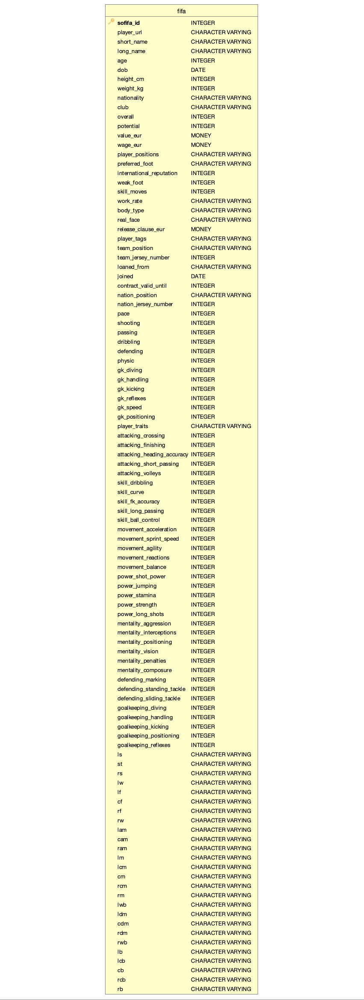
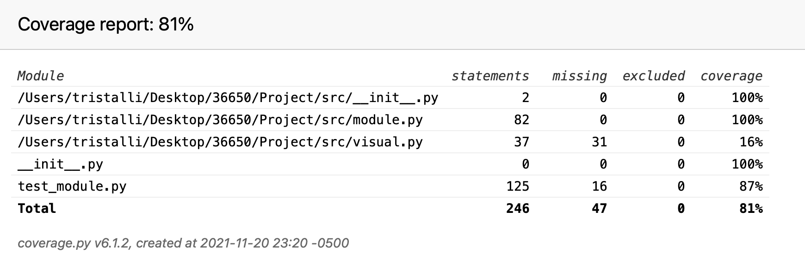
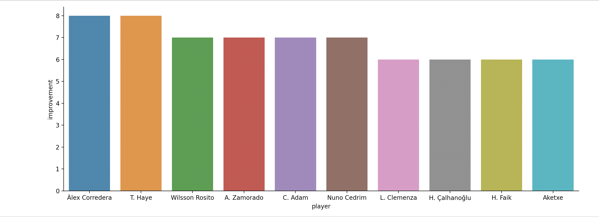
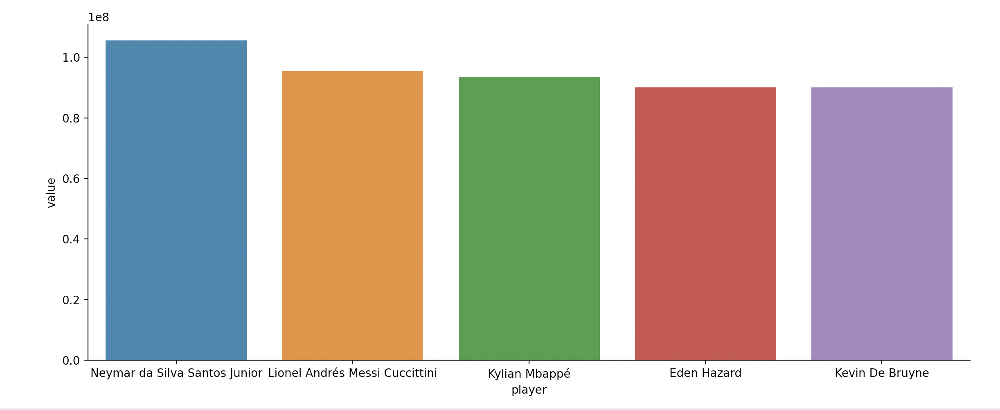
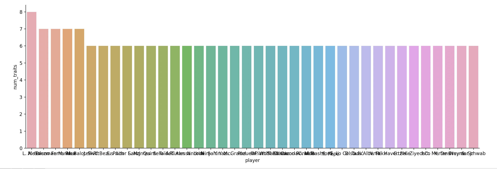

# Project Repository

**The functionality demo is in src/Example.py**\
**The link to the video is:https://cmu.box.com/s/wbpwszxcokl4ve4n7zuk6n53day4g21y**

## Task I: Build and populate necessary tables

Here is the infrastructure of the table: 



**Constraints:**
1. ```sofifa_id``` is the primary key of this dataset
2. ```dob```, ```joined``` are dates, and ```contract_valid_until``` is a four digit integer for a year. 
3. ```overall```, ```potential```, ```pace``` to ```gk_positioning```, and ```attacking_crossing``` to 
   ```goalkeeping_reflexes``` are integer scores with range 0-100 (mainly two digits scores)
4. ```ls``` to ```rb``` are addition of two integers (two digits score + one digit score). Because of the 
   existence of plus sign, they are ```varchar(4)``` type here.
5. ```international_reputation```, ```weak_foot```, and ```skill_moves``` are integer scores with range 1-5. 
6. ```prefered_foot```, ```real_face``` are binary characters with levels left/right and yes/no respectively. 
7. ```value_eur```, ```wage_eur```, and ```release_clause_eur``` are integer representing money in euros. 
8. ```height_cm``` are three digits integers, and ```weight_kg``` are two to three digits integers. 


## Task II: Conduct analytics on your dataset 

**All the codes needed in this task are contained in src/module.py**

1. List the x players who achieved highest improvement across all skillsets. The steps are:
    - Overall skill scores are calculated by averaging scores of dribbling, curve, fk accuracy, long passing and ball control.
    - The improvement is overall skill scores minus overall score of a player
    - Choose the players with top x improvement scores.\
    **Input**: x: the number of players to output\
    **Output**: a list of full names of players with top x improvements
      
2. List the y clubs that have largest number of players with contracts ending in 2021. \
    **Input**: y: the number of clubs to output\
    **Output**: list of the required club names
   
3. List the z clubs with largest number of players in the dataset where z >= 5.\
    **Input**: z: the number of clubs to output\
    **Output**: list of the required club names
   
4. Get the most popular ```nation_position``` and ```team_position``` in the dataset\
    **Output**: a dictionary with:
   - nation: most popular ```nation_position```, and 
   - team: most popular ```team_position```
    
5. Get the most popular nationality for the players in the dataset\
    **Output**: A string containing the required nationality
   
## Task III Test your Code and Document it

In this part, we did unit tests on the functions in Task I and Task II using the ```pytest``` package. 
The covered scenarios are: 

1. Test ```init_db()```:
    - Test whether the table has been created
    - Test the columns (names and types)
    
2. Test ```top_players()```, ```largest_club_2021()```, ```largest_club()```:
    - **Happy case**: 
        * The return value is not None for a valid input. 
        * Test answer for smallest value of input
        * Test answer for medium and common value of input
        * Test answer for large value of input
    - **Sad case**: Invalid input, TypeError should be reported. The inputs are: 
        * None
        * String
        * Non-integer
        * Negative value
        * Zero
        * For ```largest_club()``` only: Integer between 0-4
    
3. Test ```popular_nation_team()```, ```popular_nationality()```
    - The return value is not None
    - Correct result
    
The coverage report is documented in test/htmlcov. The overall coverage report is in index.html. 
Here is a screenshot of index.html:



We can see that the coverage for module.py is 100%. 

# Task V

**The functions in this part are documented in src/visual.py**

Here are the generated graphs:

1. 10 players with highest improvement across all skillsets: 

   
2. 5 players with highest value

   
3. 10 players with the largest number of player_traits. If there are more than 10 players, e.g. (players 9, 10, and 11 include same number of player traits), include all of them in the visualization.

   There are some overlaps in names, but when you run the code, you can zoom in to see each name without overlap. 
   

