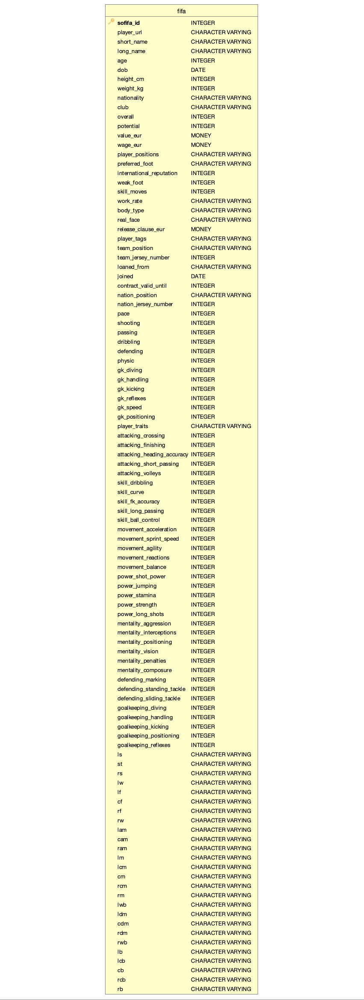

# Project Repository

## Task I: Build and populate necessary tables

Here is the infrastructure of the table: 



**Constraints:**
1. ```sofifa_id``` is the primary key of this dataset
2. ```dob```, ```joined``` are dates, and ```contract_valid_until``` is a four digit integer for a year. 
3. ```overall```, ```potential```, ```pace``` to ```gk_positioning```, and ```attacking_crossing``` to 
   ```goalkeeping_reflexes``` are integer scores with range 0-100 (mainly two digits scores)
4. ```ls``` to ```rb``` are addition of two integers (two digits score + one digit score). Because of the 
   existence of plus sign, they are ```varchar(4)``` type here.
5. ```international_reputation```, ```weak_foot```, and ```skill_moves``` are integer scores with range 1-5. 
6. ```prefered_foot```, ```real_face``` are binary characters with levels left/right and yes/no respectively. 
7. ```value_eur```, ```wage_eur```, and ```release_clause_eur``` are integer representing money in euros. 
8. ```height_cm``` are three digits integers, and ```weight_kg``` are two to three digits integers. 


## Task II: Conduct analytics on your dataset 

1. List the x players who achieved highest improvement across all skillsets. The steps are:
    - Overall skill scores are calculated by averaging scores of dribbling, curve, fk accuracy, long passing and ball control.
    - The improvement is overall skill scores minus overall score of a player
    - Choose the players with top x improvement scores.\
    **Input**: x: the number of players to output\
    **Output**: a list of full names of players with top x improvements
      
2. List the y clubs that have largest number of players with contracts ending in 2021. \
    **Input**: y: the number of clubs to output\
    **Output**: list of the required club names
   
3. List the z clubs with largest number of players in the dataset where z >= 5.\
    **Input**: y: the number of clubs to output\
    **Output**: list of the required club names
   
4. Get the most popular ```nation_position``` and ```team_position``` in the dataset\
    **Output**: a dictionary with:
   - nation: most popular ```nation_position```, and 
   - team: most popular ```team_position```
    
5. Get the most popular nationality for the players in the dataset\
    **Output**: A string containing the required nationality


